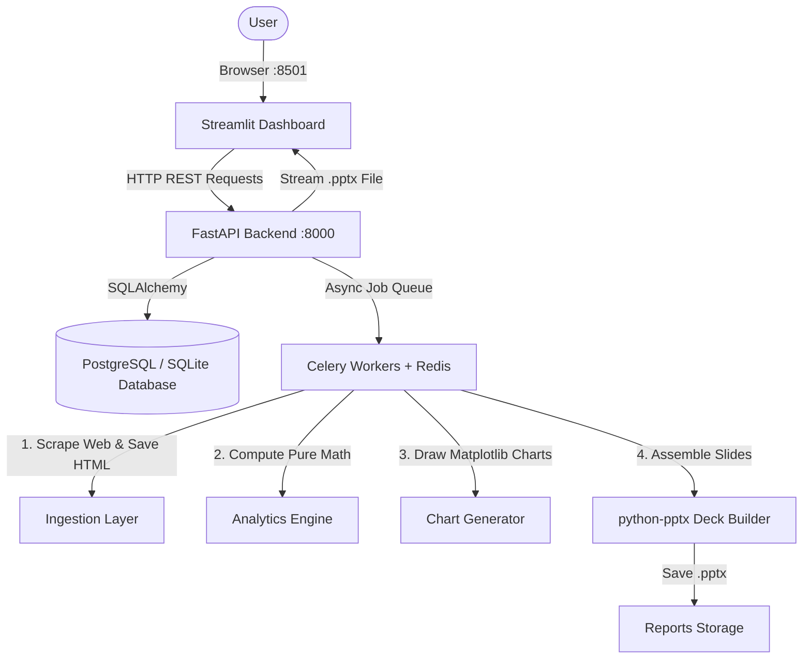

# Financial Research Automation (FRA)
### *Your Automated AI Financial Analyst & Pitch Deck Generator*

Welcome to **Financial Research Automation (FRA)**! 

If you don't have a finance or economics background, **don't worry**. Think of this platform as your personal, automated Wall Street analyst. It automatically collects financial numbers for major tech companies, calculates how healthy and profitable they are in plain terms, and builds ready-to-present PowerPoint slide decks at the click of a button.

---

## In Plain English: What Does This System Do?

Imagine you wanted to invest in or research an IT company (like **Infosys**, **TCS**, or **Microsoft**):

1. **Normally**, you would have to manually hunt down quarterly financial reports, copy numbers into Excel, write complex formulas, draw charts, and copy-paste them into a PowerPoint presentation. This takes hours.
2. **With FRA**, you pick a company name or type a stock ticker symbol. The platform automatically fetches the data, calculates the company's financial health, displays interactive charts, and produces a complete 4-slide **investor PowerPoint presentation (.pptx)** in seconds.

---

## Where Does the Data Come From?

1. **Primary Web Scraper**: The system queries public financial pages (such as **Yahoo Finance Financials** at `https://finance.yahoo.com/quote/{TICKER}/financials`).
2. **Raw HTML Safety Copy**: Before touching or parsing the data, FRA saves the exact raw HTML webpage directly to your local disk under `data/raw_html/`. If a website ever changes or goes offline, you still have the exact snapshot for auditing and debugging.
3. **Resilient Fallback**: Public websites occasionally block automated bots or change layout formats. If an anti-bot check or network glitch occurs, FRA automatically falls back to an internal structured financial statement generator, ensuring your batch reports and tests never crash.
4. **Pre-Loaded Sample Data**: To let you test immediately without waiting for scraping, the database comes pre-seeded with real quarterly data for **Infosys (INFY)**, **Tata Consultancy Services (TCS)**, and **Microsoft (MSFT)**.

---

## Finance 101: Simple Explanations of Every Metric

Here is a cheat-sheet of every financial concept used in the dashboard and reports, explained with everyday analogies:

| Financial Term | Real-World Analogy | Formula | What a Good Number Looks Like |
| :--- | :--- | :--- | :--- |
| **Revenue** (Sales) | The total cash that went into the store register before paying any bills. | Sum of all sales | Higher is better. Steady growth over time. |
| **Net Income** (Profit) | What is left in your bank account after paying employee salaries, office rent, cloud servers, and taxes. | $\text{Revenue} - \text{All Expenses}$ | Must be positive. Higher means the company actually makes money. |
| **Net Profit Margin** | Out of every \$100 the company makes in sales, how many dollars are pure profit? | $\frac{\text{Net Income}}{\text{Revenue}}$ | **15% to 25%+** is considered strong for IT services and software companies. |
| **Return on Equity (ROE)** | If investors gave the company \$100 of capital, how much profit did management generate with it? | $\frac{\text{Net Income}}{\text{Total Stockholders' Equity}}$ | **15% to 20%+** shows that management is very effective at multiplying shareholders' money. |
| **Current Ratio** (Liquidity) | A measure of safety: Can the company pay its short-term bills due in the next 12 months using its cash and short-term assets? | $\frac{\text{Current Assets}}{\text{Current Liabilities}}$ | **1.5x to 2.5x** is healthy. If below 1.0x, the company owes more in the short term than it has in quick cash. |
| **YoY Growth** (Year-over-Year) | Comparing this quarter's sales to the **exact same quarter last year** (e.g., Q1 2024 vs Q1 2023). Avoids seasonal distortion. | $\frac{\text{Rev}_{\text{this year}} - \text{Rev}_{\text{last year}}}{\text{Rev}_{\text{last year}}}$ | Positive growth (e.g. **+8% to +15%**) shows an expanding business. |
| **QoQ Growth** (Quarter-over-Quarter) | Comparing this quarter's sales to the **immediately preceding quarter** (e.g., Q2 vs Q1). | $\frac{\text{Rev}_{\text{this quarter}} - \text{Rev}_{\text{last quarter}}}{\text{Rev}_{\text{last quarter}}}$ | Shows immediate short-term business momentum. |
| **Peer Percentile Ranking** | Grading companies "on a curve" against their rivals. If Company A has a **75th percentile** Net Margin, it is more profitable than 75% of competitors in its group. | Statistical rank ($0\%$ to $100\%$) | **50th** is average; **80th+** is an industry leader. |

---

## How Everything Works Behind the Scenes (Architecture)

FRA is built in distinct, isolated layers so that no single error can bring down the entire system:



### 1. Ingestion Layer (`src/ingestion/`)
- Takes a company ticker (like `INFY` or `AAPL`).
- Downloads the quarterly income statements and balance sheets with exponential backoff retry.
- Saves raw HTML files to `data/raw_html/` for auditing.
- Parses numbers cleanly and inserts them into flexible key-value database rows.
- **Failure Isolation**: If one company's scrape fails, it is caught safely and will never crash other batch jobs.

### 2. Analytics Engine (`src/analytics/`)
- A standalone, pure Python math module.
- Has **no database or website code inside it**.
- Takes pure numbers and computes margins, ROE, YoY/QoQ growth, and statistical peer percentile ranks using Pandas.

### 3. Reporting Engine (`src/reporting/`)
- Generates high-resolution Matplotlib charts:
  - Multi-bar **Revenue & Net Income Trajectory**
  - Line graph of **Profit Margins vs ROE**
  - Horizontal bar chart of **Peer Competitive Standings**
- Assembles an institutional 4-slide widescreen PowerPoint deck (`.pptx`) with professional dark/navy themes, executive KPI cards, tables, and analytical takeaways.

### 4. API Layer (`src/api/`)
- Built with **FastAPI**.
- **Crucial Security Guardrail**: The API is the **only component allowed to touch the database**. The dashboard and report generators never write to or read from the database directly; they communicate strictly over HTTP.

### 5. Frontend Dashboard (`src/dashboard/`)
- An interactive web application built with **Streamlit**.
- Features an executive dark theme with glassmorphism KPI cards, interactive trend charts, and a non-blocking **"Generate PPTX Report"** button with real-time status polling.

---

## How to Run the Project

### If you are using Git Bash:

#### 1. Open Terminal 1 — Start the FastAPI Backend:
```bash
source .venv/Scripts/activate
uvicorn src.api.main:app --host 0.0.0.0 --port 8000 --reload
```
* Interactive API Documentation: Open **[http://localhost:8000/docs](http://localhost:8000/docs)**

#### 2. Open Terminal 2 — Start the Streamlit Dashboard:
```bash
source .venv/Scripts/activate
streamlit run src/dashboard/app.py --server.port=8501
```
* Interactive Dashboard: Open **[http://localhost:8501](http://localhost:8501)**

---

## How to Use the Dashboard

1. **Select a Company**: In the left sidebar dropdown, choose **Infosys (INFY)**, **TCS**, or **Microsoft (MSFT)**.
2. **Review the Scorecards**: Look at the top cards to see the company's latest quarterly revenue, net profit margin, and whether growth was positive (green) or negative (red).
3. **Explore Analytics Tabs**:
   - **Financial Trajectory**: Interactive bar charts of revenues and profits.
   - **Ratio & Margin Dynamics**: Line charts showing how profitability and cash safety change over time.
   - **Peer Benchmark Ranking**: See how the selected company stacks up against its industry rivals.
   - **Financial Statements**: Raw numbers categorized by quarter.
4. **Generate a PowerPoint Pitch Deck**:
   - Click the blue **"Generate PPTX Report"** button in the top right.
   - The app will run an asynchronous background job without freezing your browser.
   - Once complete, click **"Download Presentation (.pptx)"** to save the deck to your computer.

---

## Running Automated Tests

To verify that all calculations, scraping fallbacks, API routes, and presentation builders are functioning with 100% accuracy:

```bash
source .venv/Scripts/activate
pytest tests/ -v
```
*All 20 unit and integration tests will run and pass in ~5 seconds.*

---

## Running with Docker Compose (Production Setup)

If you have Docker Desktop installed, you can start the entire multi-container stack (PostgreSQL database, Redis cache, FastAPI server, Celery worker, and Streamlit dashboard) with a single command:

```bash
docker-compose up --build
```
- **Streamlit**: `http://localhost:8501`
- **FastAPI**: `http://localhost:8000/docs`
- **PostgreSQL**: port `5432`
- **Redis**: port `6379`
