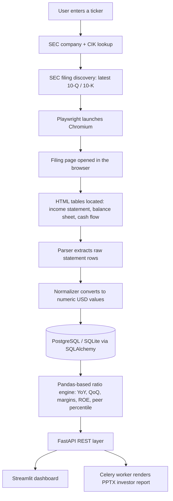

# Financial Research Automation

Financial Research Automation (FRA) is an end-to-end pipeline that scrapes real
quarterly financial statements straight from **SEC EDGAR filings** using a live
Chromium browser, normalizes and stores the extracted figures, computes
financial ratios and peer benchmarks, and turns the result into an
investor-grade PowerPoint report — all served through a FastAPI backend and a
Streamlit dashboard.

There is no seeded, mocked, or synthetic financial data anywhere in the
running application. Every number in the database was extracted from a real
10-Q/10-K filing on `sec.gov`; if a scrape fails, the pipeline fails loudly
instead of silently substituting fake figures.

## Quickstart (no Docker, no Redis)

The fastest way to run this locally with a visible Chromium browser and no
external services (Postgres/Redis) at all:

```bash
python -m venv .venv
. .venv/bin/activate                    # Windows: .venv\Scripts\activate

pip install -r requirements.txt
python -m playwright install chromium

cp .env.example .env
# Edit .env and set SEC_USER_AGENT to "AppName/Version your-email@example.com"
# -- SEC EDGAR requires a descriptive, contactable user agent on every
# request. Everything else in .env.example already defaults to the
# no-Redis, visible-browser, SQLite setup below.

python scripts/start_app.py
```

This starts the API on `http://localhost:8000` and the dashboard on
`http://localhost:8501`, with `CELERY_TASK_ALWAYS_EAGER=true` (ingestion
runs synchronously in the API process -- no Redis broker or separate worker
needed) and `SCRAPER_HEADLESS=false` (the Chromium window scraping the real
filing is visible). Enter a ticker in the dashboard sidebar to trigger a
real scrape; the database starts empty and is populated only by real
ingestion.

**If you edit code under `src/`, restart `python scripts/start_app.py`.**
It runs `uvicorn` without `--reload`, and in `CELERY_TASK_ALWAYS_EAGER=true`
mode the ingestion task executes inside that same API process — so a code
change won't take effect until the process is restarted, even though the
Streamlit dashboard itself does hot-reload on save.

For a fully headless run (no visible browser, e.g. CI): `python
scripts/start_app.py --headless`.

## Architecture


```mermaid
flowchart TD
    A[User enters a ticker] --> B[SEC company + CIK lookup]
    B --> C[SEC filing discovery: latest 10-Q / 10-K]
    C --> D[Playwright launches Chromium]
    D --> E[Filing page opened in the browser]
    E --> F[HTML tables located: income statement, balance sheet, cash flow]
    F --> G[Parser extracts raw statement rows]
    G --> H[Normalizer converts to numeric USD values]
    H --> I[(PostgreSQL / SQLite via SQLAlchemy)]
    I --> J[Pandas-based ratio engine: YoY, QoQ, margins, ROE, peer percentile]
    J --> K[FastAPI REST layer]
    K --> L[Streamlit dashboard]
    K --> M[Celery worker renders PPTX investor report]
```

## Why this stack

- **SEC EDGAR** is the official, free, public source of company financial
  statements — no paid market-data API keys required.
- **Playwright + Chromium** perform real browser automation against the live
  filing page, rather than an HTTP-only scrape, so the extraction is visible
  and demonstrable step by step.
- **FastAPI** is the only component allowed to touch the database; the
  dashboard and the Celery workers talk to it exclusively over HTTP. Routes
  run against an async SQLAlchemy engine (`asyncpg`/`aiosqlite`) so the API
  can serve concurrent requests without blocking on database I/O; Celery
  workers keep a separate synchronous engine, since a worker's execution
  model is inherently synchronous per process.
- **Celery + Redis** decouple slow work (a live browser scrape, a multi-slide
  PPTX render) from the request/response cycle.
- **Pandas** computes every derived metric (YoY/QoQ growth, net margin, ROE,
  current ratio, peer percentile ranking) from the normalized line items —
  nothing is hardcoded.

## Data flow

1. A ticker is submitted (via the dashboard, the API, or the CLI).
2. `SECClient` resolves the company's CIK and looks up its most recent
   several 10-Q/10-K filings (falling back to 10-K when needed) from
   `data.sec.gov`, with retries, jittered throttling, and a TTL'd disk cache.
3. Playwright launches Chromium once and, for each filing, navigates the
   same browser tab directly to the filing document on `sec.gov`.
4. The scraper locates the income statement, balance sheet, and cash flow
   statement tables in the rendered page (parsed with BeautifulSoup/lxml)
   and extracts every labeled row.
5. The normalizer converts raw text (`"$(2,345)"`, `"$94,036 million"`, etc.)
   into signed numeric USD values.
6. Line items are upserted into the database under the correct company and
   reporting period, derived from the filing's own reported period date.
7. The analytics engine computes ratios and peer percentiles on demand.
8. Charts (Matplotlib) and a 4-slide investor PPTX (python-pptx) are
   generated asynchronously by a Celery worker.

## CAPTCHA / anti-bot handling

The pipeline never attempts to bypass a CAPTCHA or access challenge. It
detects one (including Cloudflare-style interstitials), saves a screenshot
and the page HTML for debugging, and either pauses for a human to resolve it
manually (demo mode) or fails the scrape outright (headless/automated mode).

## Scraping resilience & stealth

The scraper is built to behave like a real, careful visitor rather than a
predictable script:

- **Randomized fingerprint per session** — each scraping session gets a
  fresh browser context with a randomized viewport, user agent, locale, and
  timezone, plus init-script patches that remove the most common automation
  tells (`navigator.webdriver`, empty plugin lists, missing `window.chrome`).
- **Human-like pacing** — every navigation and extraction step is followed
  by a short, randomized delay instead of firing requests back-to-back.
- **Retries with exponential backoff + jitter** — both SEC HTTP requests and
  Playwright page navigations retry transient failures (timeouts, 429/5xx)
  automatically via `tenacity` instead of failing the whole ingestion job.
- **Robust HTML parsing** — filing tables are parsed with BeautifulSoup/lxml
  rather than regular expressions, which tolerates the inconsistent markup
  real SEC filings actually ship with.
- **Multi-quarter historical backfill** — ingestion scrapes the last several
  10-Q/10-K filings (configurable via `SCRAPER_BACKFILL_QUARTERS`) in one
  browser session, reusing a single tab across filings, so YoY/QoQ analytics
  have real historical data instead of one snapshot quarter.

## SEC rate-limit etiquette

Every request carries a descriptive `User-Agent`, is throttled with a
configurable delay plus random jitter, and successful responses are cached
on disk with a TTL (`SEC_CACHE_TTL_SECONDS`) so repeated lookups for the same
ticker don't re-hit SEC servers unnecessarily while still refreshing
periodically.

## API hardening

- **Auth** — read (`GET`) endpoints stay open so the app is easy to demo;
  mutating endpoints (`POST /companies`, `POST /ingest`, `POST /reports`,
  `PATCH /reports/{id}/status`) require an `X-API-Key` header when
  `API_KEY` is configured. Leaving it empty (the default) disables auth for
  local development.
- **Rate limiting** — `POST /ingest` and `POST /reports` are rate-limited
  per client IP (`RATE_LIMIT_INGEST`, `RATE_LIMIT_REPORTS`), since each
  triggers a real browser scrape or PPTX render.
- **Pagination** — `GET /companies` takes `skip`/`limit` query params and
  returns `{items, total, skip, limit}`.
- **Structured errors** — every error response (404, 422 validation, 429
  rate limit, 500) comes back in one consistent shape:
  `{"error": {"status_code", "message", "path", "details"?}}`.

## Observability & performance

- **Structured JSON logs** — every log line is a JSON object
  (`timestamp`, `level`, `logger`, `request_id`, `message`, plus any extra
  fields) via `python-json-logger`. Set `LOG_JSON=false` for
  human-readable text logs during local development.
- **Request correlation IDs** — `RequestIdMiddleware` assigns a request ID
  (echoing `X-Request-ID` if the caller sent one, otherwise a fresh UUID),
  makes it available to every log line emitted while handling that
  request via a `contextvar`, and returns it on the response so a client
  can correlate its request with server-side logs.
- **Prometheus metrics** — `GET /metrics` exposes auto-instrumented
  request count/latency histograms plus custom counters/histograms for
  ingestion and report-generation outcomes and durations, and cache
  hit/miss counts. Under Celery's default (separate worker process), task
  metrics only show up on the API's own `/metrics` when
  `CELERY_TASK_ALWAYS_EAGER=true` (local/demo mode) — spreading metrics
  across processes correctly needs `prometheus_client`'s multiprocess
  mode, which is out of scope here.
- **Redis caching** — `POST /compare` (the most computationally expensive
  endpoint: it recomputes ratios and percentile rankings for every
  selected company) is cached cache-aside style, keyed by the sorted
  company IDs, for `CACHE_TTL_SECONDS`. If Redis is unreachable, every
  cache call degrades gracefully to a miss/no-op rather than failing the
  request.

## Installation

```bash
python -m venv .venv
. .venv/bin/activate          # Linux/macOS
.venv\Scripts\activate        # Windows

pip install -r requirements.txt
python -m playwright install chromium
```

## Environment variables

```bash
cp .env.example .env
```

Set `SEC_USER_AGENT` to `AppName/Version your-email@example.com` — SEC EDGAR
requires a descriptive, contactable user agent on every request.

Key variables:

| Variable | Purpose |
|---|---|
| `SEC_USER_AGENT` | Required by SEC EDGAR on every request |
| `SEC_REQUEST_DELAY` | Base seconds between SEC requests (politeness throttle) |
| `SEC_REQUEST_JITTER` | Extra random seconds added on top of the base delay |
| `SEC_MAX_RETRIES` | Retry attempts for transient SEC request failures |
| `SEC_CACHE_TTL_SECONDS` | How long a cached SEC response stays valid before refetching |
| `SCRAPER_HEADLESS` | `false` shows the live Chromium browser (demo mode) |
| `SCRAPER_SLOW_MO` | Slows down browser actions for visible demos |
| `SCRAPER_MIN_DELAY_MS` / `SCRAPER_MAX_DELAY_MS` | Randomized human-like delay range between scraping steps |
| `SCRAPER_BACKFILL_QUARTERS` | Number of most-recent filings to scrape per ingestion (historical backfill) |
| `DATABASE_URL` | SQLite by default; Postgres in Docker Compose. The API derives its async URL from this automatically |
| `CELERY_TASK_ALWAYS_EAGER` | `true` runs Celery tasks synchronously (no Redis needed) for local dev |
| `API_KEY` | Empty disables auth (default); set to require `X-API-Key` on mutating endpoints |
| `RATE_LIMIT_INGEST` / `RATE_LIMIT_REPORTS` | Per-IP rate limits (e.g. `10/minute`) on the scrape/report endpoints |
| `LOG_JSON` | `true` (default) emits structured JSON logs; `false` for human-readable text |
| `CACHE_TTL_SECONDS` | How long a cached `/compare` response stays valid before recomputing |

## Running the pipeline

Scrape a single company end to end from the CLI:

```bash
python scripts/run_pipeline.py AAPL --demo       # visible Chromium window
python scripts/run_pipeline.py AAPL --headless   # no UI, for automation/CI
```

Start the full application (API + dashboard together):

```bash
python scripts/start_app.py            # visible browser scraping
python scripts/start_app.py --headless # headless scraping
```

Or run each service yourself:

```bash
uvicorn src.api.main:app --reload
streamlit run src/dashboard/app.py
```

Once running, ingest a company from the dashboard sidebar or via the API:

```bash
curl -X POST http://localhost:8000/ingest -H "Content-Type: application/json" \
  -d '{"ticker": "AAPL"}'
```

This is the only way data enters the database — there is no seed script.

## Docker

```bash
docker compose up --build
```

Brings up PostgreSQL, Redis, the FastAPI API, a Celery worker, and the
Streamlit dashboard. Database tables are created via Alembic migrations on
startup; the database starts empty and is populated only by real ingestion
requests.

## Testing

```bash
python -m pytest tests/ -q
```

Unit and integration tests cover the normalizer, parser, analytics engine,
API routes, and PPTX/report generation. Network-dependent scraping is
exercised against a local HTML fixture (`tests/fixtures/sec_filing_mock.html`)
and by patching the ingestion entry point in isolation tests — this fixture
data is used only inside the test suite and never reaches the running
application or its database.

## Project structure

```
src/
  core/        # settings, database engine, Celery app, logging
  ingestion/   # SEC client, filing discovery, Playwright browser, scraper,
               # HTML parser, value normalizer, Celery ingestion task
  models/      # SQLAlchemy ORM models (Company, FinancialPeriod,
               # FinancialLineItem, ComputedRatio, ReportJob)
  schemas/     # Pydantic request/response models
  analytics/   # Pure, dependency-free financial ratio + percentile math
  reporting/   # Matplotlib charts, python-pptx report builder, Celery task
  api/         # FastAPI app and routers (companies, compare, reports, ingest)
  dashboard/   # Streamlit executive dashboard + API client
alembic/       # Database migrations
scripts/       # CLI entry points (run_pipeline.py, start_app.py)
tests/         # pytest suite
docs/          # Plain-language project docs (overview, architecture, interview prep)
```

## Documentation

The [`docs/`](docs/README.md) folder has the full project write-up in
simple language: project overview, tech stack, architecture, a tour of the
code, future scope, and an interview-prep Q&A (technical + business).

## Limitations

- SEC filing HTML structure varies by filer and can change over time; some
  filings may need statement-specific parsing adjustments.
- A CAPTCHA or access challenge requires manual resolution in demo mode, or
  causes the scrape to fail safely in headless mode.
- Live browser scraping should be run respectfully and in compliance with
  SEC's fair-access policy (descriptive User-Agent, request throttling).
