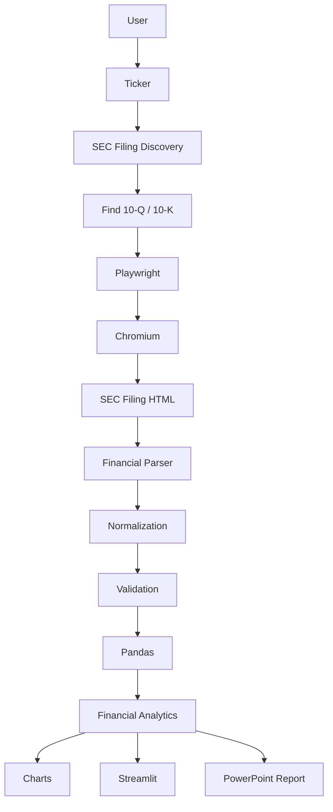

# Financial Research Automation

Financial Research Automation (FRA) is a Python-based SEC filing analysis pipeline that resolves companies, discovers the latest 10-Q/10-K filings, opens them in a visible Playwright + Chromium browser, extracts financial statement tables, normalizes the values, validates the result, and evaluates the company using financial analytics and charts.

## Overview

This project is deliberately moving away from the old Yahoo Finance-centric workflow and toward a browser-based SEC EDGAR pipeline. The main principles are:

- SEC EDGAR is the primary financial data source.
- Playwright + Chromium are used for the live browser scraping demonstration.
- SEC API discovery is used for company lookup and filing metadata.
- Financial values are normalized before analytics.
- Data is traceable back to the filing and statement line item.
- Demo mode opens a visible browser so the extraction process can be watched.

## Architecture


```mermaid
flowchart TD
    A[User] --> B[Ticker]
    B --> C[SEC Filing Discovery]
    C --> D[Find 10-Q / 10-K]
    D --> E[Playwright]
    E --> F[Chromium]
    F --> G[SEC Filing HTML]
    G --> H[Financial Parser]
    H --> I[Normalization]
    I --> J[Validation]
    J --> K[Pandas]
    K --> L[Financial Analytics]
    L --> M[Charts]
    L --> N[Streamlit]
    L --> O[PowerPoint Report]
```

## Data flow

1. A company ticker is entered.
2. SEC company lookup and filing discovery resolve the latest filing metadata.
3. The browser opens the filing page in Chromium.
4. The scraper locates the income statement, balance sheet, and cash flow tables.
5. Raw values are parsed and normalized.
6. Validation checks for missing/malformed data or suspicious balances.
7. Pandas is used to compute finance metrics and trends.
8. Charts and a PowerPoint report are generated.

## Primary technology stack

- Python
- Playwright
- Chromium
- SEC EDGAR
- Pandas
- Matplotlib / Plotly
- Streamlit
- python-pptx

## Why SEC EDGAR

SEC EDGAR is the official public filing source for company financial statements. It offers a consistent and well-documented source for 10-Q and 10-K filings, and it does not depend on market-price wrappers like Yahoo Finance.

## Why Playwright

Playwright provides real browser automation and is suitable for demonstrating the physical extraction path visible in a live Chromium window. This matches the project requirement to show browser-based scraping rather than replacing it with a direct HTTP API-only approach.

## Installation

Create a Python environment and install dependencies:

```bash
python -m venv .venv
. .venv/bin/activate  # Linux/macOS
.venv\Scripts\activate  # Windows
pip install -r requirements.txt
python -m playwright install chromium
```

## Environment variables

Copy the example file and adjust values as needed:

```bash
cp .env.example .env
```

Key variables include:

- SEC_USER_AGENT
- SCRAPER_HEADLESS
- SCRAPER_SLOW_MO
- SCRAPER_TIMEOUT
- DEBUG
- SEC_REQUEST_DELAY

## Demo mode

```bash
python scripts/run_pipeline.py AAPL --demo
```

This opens a visible Chromium browser and shows the filing being processed step by step.

## Headless mode

```bash
python scripts/run_pipeline.py AAPL --headless
```

This runs without visible browser UI and is intended for automation and CI usage.

## CLI usage

```bash
python scripts/scrape_company.py AAPL --demo
python scripts/scrape_company.py AAPL --headless
python scripts/run_pipeline.py AAPL --demo
```

## Streamlit dashboard

```bash
streamlit run src/dashboard/app.py
```

## Testing

```bash
python -m pytest tests/ -q
```

## Project structure

- src/core — central config and logging
- src/ingestion — SEC client, browser, discovery, scraper, parser, normalizer
- src/analytics — financial analytics modules
- src/reporting — charts, report generation, PPTX builder
- src/dashboard — Streamlit app
- data/ — raw, processed, cache, debug, reports

## Debugging and screenshots

The scraper writes debug artifacts into the data directory, including screenshots and HTML snapshots for failed pages and CAPTCHA detection.

## CAPTCHA and access challenges

The pipeline does not bypass CAPTCHA or anti-bot controls. Instead, it detects challenges, logs a warning, saves screenshots and HTML, and pauses in demo mode until the user completes the manual step.

## SEC rate-limit considerations

The project uses a descriptive User-Agent, request throttling, duplicate-request prevention, and cached metadata to avoid unnecessary SEC traffic.

## Data provenance

Every extracted value should be traceable to a filing, statement, and line item. The system keeps the raw values as well as normalized values so the source is visible in downstream reporting.

## Limitations

- SEC filing structure can change over time.
- Some HTML layouts require statement-specific parsing logic.
- Live browser-based scraping should be used carefully and in compliance with SEC and site policies.
- CAPTCHA or anti-bot checks require manual intervention in demo mode.
